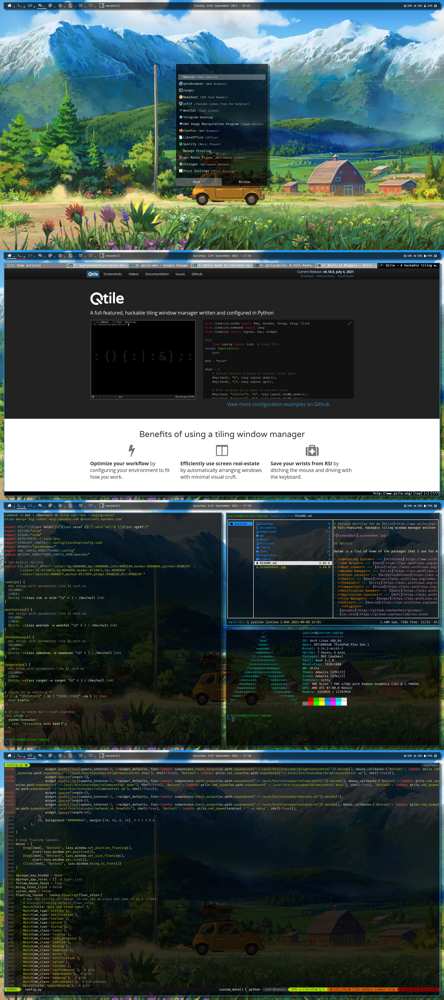

# Various dotfiles for my current [Qtile](http://www.qtile.org/) setup running under Wayland.
A full-featured, hackable tiling window manager written and configured in Python.
Please note that I use the latest Qtile from their GitHub repo using the AUR [Qtile](https://aur.archlinux.org/packages/qtile-git)

## Details

Below is a list of some of the packages that I use for my current setup which consists of two screens. A monitor as screen 0 and the laptop as screen 1.
The idle management and screen locker currently do not function with Qtile running under Wayland but work to resolve this is currently under way.

- **Operating System** --- [Archlinux](https://www.archlinux.org/)
- **AUR Helper** --- [Paru](https://aur.archlinux.org/packages/paru-git/)
- **Boot Loader** --- [Grub](https://wiki.archlinux.org/index.php/GRUB)
- **Resource Monitor** --- [Btop](https://aur.archlinux.org/packages/btop-git)
- **Window Manager** --- [Qtile](https://aur.archlinux.org/packages/qtile-git)
- **Screen Hotplug** --- [Kanshi](https://aur.archlinux.org/packages/kanshi-git)
- **Screen Locker** --- [Swaylock Effects](https://aur.archlinux.org/packages/swaylock-effects-git)
- **Screenshots** --- [Grim](https://aur.archlinux.org/packages/grim-git)
                  --- [Slurp](https://aur.archlinux.org/packages/slurp-git)
- **Window Switcher** --- [Custom made for Qtile (Wayland only)](https://github.com/justinesmithies/qtile-wayland-dotfiles/blob/master/.local/bin/qtile-window-switcher.py)
- **Idle Management Daemon** --- [Swayidle](https://aur.archlinux.org/packages/swayidle.git)
- **Wayland output power management** --- [Wlopm](https://aur.archlinux.org/packages/wlopm-git)
- **Shell** --- [Bash](https://archlinux.org/packages/core/x86_64/bash/) using [Starship](https://aur.archlinux.org/packages/starship-git/) 
- **Completer** --- [Bash Completion](https://archlinux.org/packages/extra/any/bash-completion/)
- **Terminal** --- [Kitty](https://wiki.archlinux.org/index.php/Kitty)
- **Notification Daemon** --- [Dunst](https://archlinux.org/packages/community/x86_64/dunst/)
- **Application Launcher** --- [Rofi Wayland](https://aur.archlinux.org/packages/rofi-lbonn-wayland-git)
- **File Manager** --- [Ranger](https://aur.archlinux.org/packages/ranger-git)
- **Image Viewer** --- [Imv](https://archlinux.org/packages/community/x86_64/imv)
- **Document Scanner** -- [Simple-scan](https://archlinux.org/packages/community/x86_64/simple-scan)
- **Editor** --- [Neovim](https://aur.archlinux.org/packages/neovim-git)
  - **Plugins**
	- [gruvbox](https://github.com/morhetz/gruvbox)
	- [coc.nvim](https://github.com/neoclide/coc.nvim)
	- [vim-polyglot](https://github.com/sheerun/vim-polyglot)
	- [vim-startify](https://github.com/mhinz/vim-startify)
	- [tagbar](https://github.com/preservim/tagbar)
	- [nerdtree](https://github.com/preservim/nerdtree)
	- [vim-devicons](https://github.com/ryanoasis/vim-devicons)
	- [vim-nerdtree-syntax-highlight](https://github.com/tiagofumo/vim-nerdtree-syntax-highlight)
	- [vim-airline](https://github.com/vim-airline/vim-airline)
	- [vim-airline-themes](https://github.com/vim-airline/vim-airline-themes)
	- [indentLine](https://github.com/Yggdroot/indentLine)
	- [vim-hexokinase](https://github.com/rrethy/vim-hexokinase)
- **Web Browser** --- [Qutebrowser](https://www.qutebrowser.org)
- **Multimedia Framework**
	- **PipeWire**
		- [PipeWire](https://archlinux.org/packages/extra/x86_64/pipewire)
		- [PipeWire-Alsa](https://archlinux.org/packages/extra/x86_64/pipewire-alsa)
		- [PipeWire-Jack](https://archlinux.org/packages/extra/x86_64/pipewire-jack)
		- [Wireplumber](https://archlinux.org/packages/extra/x86_64/wireplumber)
		- [PipeWire-Pulse](https://archlinux.org/packages/extra/x86_64/pipewire-pulse)
		- [PipeWire-v4l2](https://archlinux.org/packages/extra/x86_64/pipewire-v4l2)
- **PDF Viewer** --- [Zathura](https://wiki.archlinux.org/index.php/Zathura)
- **IRC** --- [Weechat](https://weechat.org/)
- **RSS Feed Reader** --- [Newsboat](https://aur.archlinux.org/packages/newsboat-git)
- **Youtube Downloader** --- [Yt-dlp (youtube-dl fork)](https://aur.archlinux.org/packages/yt-dlp-git) with [Yt-dlp-drop-in](https://aur.archlinux.org/packages/yt-dlp-drop-in)
- **Video player** --- [Mpv](https://aur.archlinux.org/packages/mpv-git)

## Keybindings
### Window manager controls
| Keys                                 | Action                    |
| ------------------------------------ | ------------------------- |
| <kbd>CTRL + MOD + r</kbd>            | restart Qtile             |
| <kbd>CTRL + MOD + q</kbd>            | shutdown Qtile            |
| <kbd>CTRL + MOD + w</kbd>            | Open window switcher      |
| <kbd>MOD + w</kbd>                   | kill window               |
| <kbd>MOD + RETURN</kbd>              | spawn terminal            |
| <kbd>CTRL + Space</kbd>              | Rofi menu                 |
| <kbd>CTRL + MOD + p</kbd>            | Rofi power menu           |
